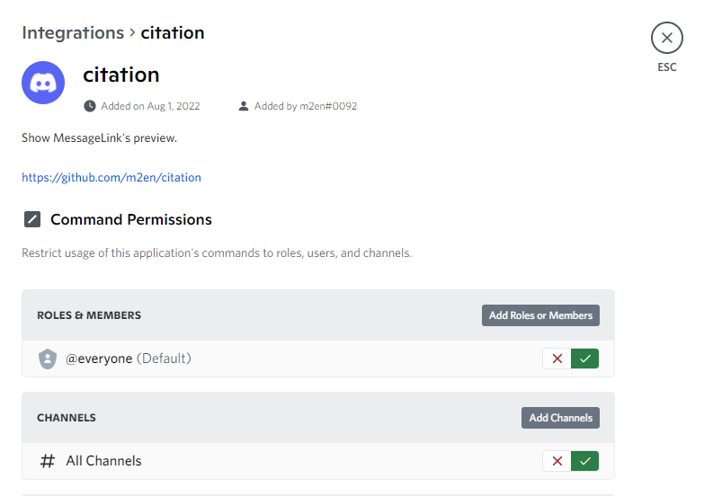
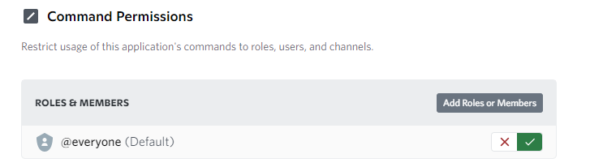
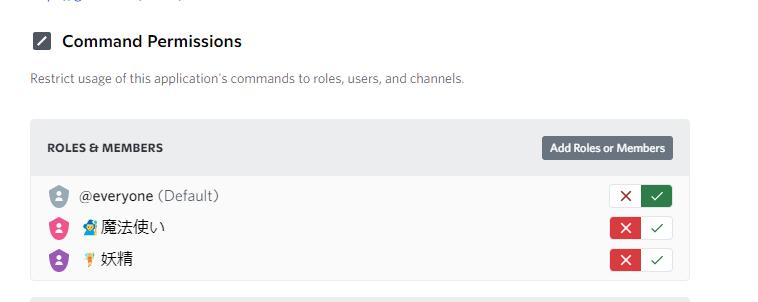
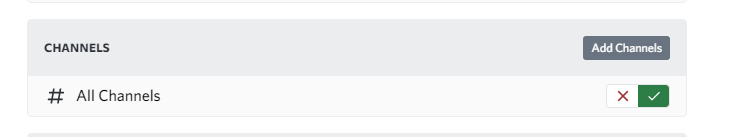
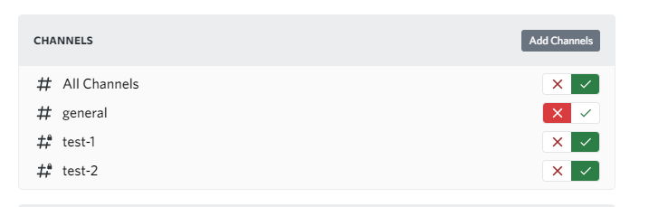
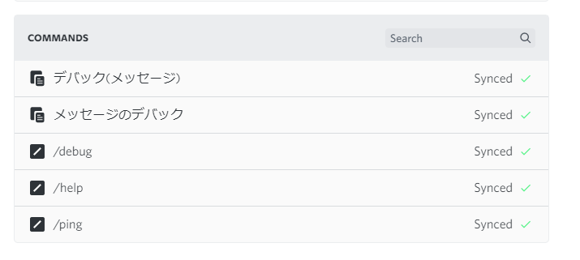

# コマンドの権限を設定する

[CommandPermission v2](https://support.discord.com/hc/ja/articles/4644915651095) から今まで開発者レベルでしか設定できなかったSlash Commandの権限がギルドレベルで設定できるようになりました。

このページでは、コマンドの権限を設定する方法を説明します。

> **Warning**
> メッセージコマンドの `!register` に対しては権限を設定することは出来ず、デフォルトの `MANAGE_SERVER` (サーバー管理の権限)を持っている人のみが利用でき、この設定を変更することは出来ません。

> **Warning**
> ここで設定した権限設定はサーバーのオーナー(サーバー所有者)に影響しない点にご注意ください。
> サーバー所有者はこれらの権限をオーバーライドします。

----

- [コマンド設定画面への行き方](#コマンド設定画面への行き方)
- [ロール・メンバーに対して設定する](#ロール・メンバーに対して設定する)
  - [デフォルトでメンバーの設定を行う](#デフォルトでメンバーの設定を行う)
  - [ロール・メンバーを追加して個別で設定する](#ロール・メンバーを追加して個別で設定する)
- [チャンネルに対して設定する](#チャンネルに対して設定する)
  - [デフォルトの設定](#デフォルトの設定)
  - [チャンネルを追加して個別で設定する](#チャンネルを追加して個別で設定する)
- [コマンドに対して設定する](#コマンドに対して設定する)

## コマンド設定画面への行き方

コマンド設定画面には次の手段でいくことが出来ます。

**日本語版:** サーバー設定 > 連携サービス > Bot及びアプリ > citation

**英語版:** Server Settings > Integrations > Bots and Apps > citation

## ロール・メンバーに対して設定する

ここではロール・メンバーに対して権限の設定を行うことが出来ます。

### デフォルトでメンバーの設定を行う

デフォルトでは `@everyone` つまり、ギルドのメンバー全員に対して権限を設定することが出来ます。

`☓`で無効、`✓`で有効にします。**無効になっている場合はサーバー所有者を除く全てのメンバーが全てのコマンドへアクセスできなく**なります。

### ロール・メンバーを追加して個別で設定する

**ロールまたはメンバーを追加する**(Add Roles or Members)からロール・メンバーを追加し個別に設定することが出来ます。

## チャンネルに対して設定する

ここではチャンネルに対して設定することができます。

要するに使用できるチャンネルと使用できないチャンネルを分けることが出来るイメージです。

### デフォルトの設定

デフォルトでは 全てのチャンネル(All Channels) つまり、全チャンネルで権限を設定することが出来ます。

`☓`で無効、`✓`で有効にします。**無効になっている場合は全てのチャンネルが全てのコマンドへアクセスできなく**なります。

> **Warning**
> citationはアクセスできないチャンネルにはこの設定関係なしに利用出来ない点に注意してください。

### チャンネルを追加して個別で設定する

**チャンネルを追加する**(Add Channels)からチャンネルを追加し個別に設定することが出来ます。

## コマンドに対して設定する

ここではコマンドに対して設定することができます。

コマンドごとに使えるメンバーと使えるチャンネル、使えないメンバーと使えないチャンネルを設定します。

これらの設定は上記の設定と同期しています。(チャンネル・カテゴリーの権限設定と同じイメージ)
