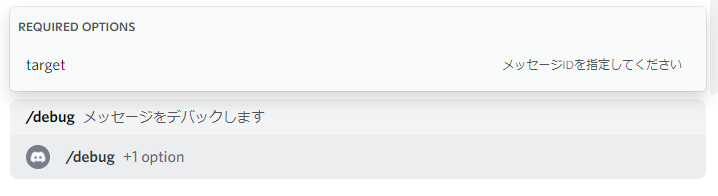

# メッセージデバック

メッセージデバックとは、メッセージをコードブロックとして表示し、テストすることが出来る機能です。

> **Warning**
> メッセージデバックを使用するにはコマンドを登録する必要があります。
> 詳しくは [Getting Started](../getting-started.md) を参照してください。

----

- [メッセージをデバックする](#メッセージをデバックする)
- [メッセージデバックの注意点](#メッセージデバックの注意点)

----

## メッセージをデバックする

メッセージをデバックするのは `debug` コマンドを使用します。

オプション `target` にテストしたいメッセージIDを指定し実行します。

citationが利用するAPI Wrapper **Kord** のチャンネルからメッセージを取得する仕様上、citationはコマンドが実行されたチャンネルからメッセージを参照します。

コマンドが実行されたチャンネルにメッセージが見つからない場合は引用できません。

## メッセージデバックの注意点

デバックしようとしたメッセージにバッククォートが含まれている場合はcitationはシングルクォーテーションに置換し、表示します。

これはデバックのコードブロックを崩さないためです。
